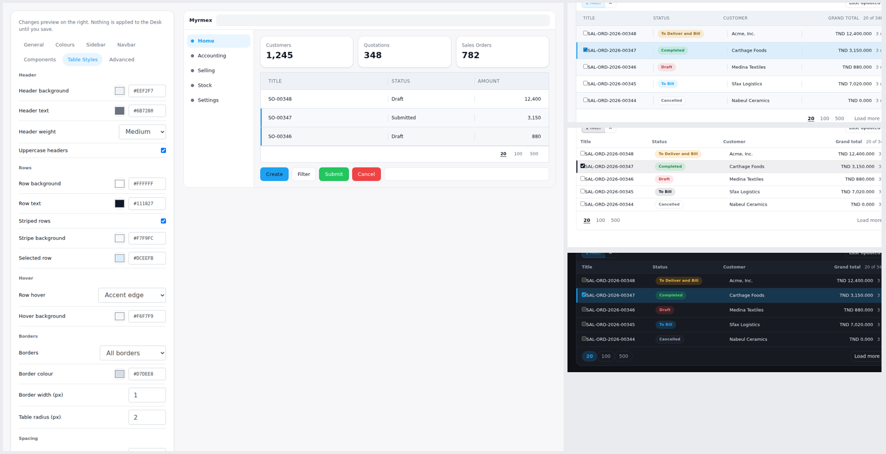
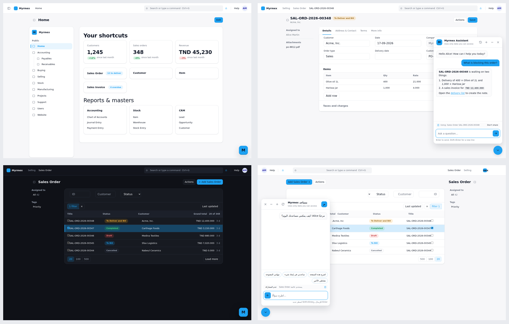

# Theme Myrmex

A modern UI/UX layer and a built-in AI assistant for **ERPNext v15** on
**Frappe Framework v15**.

Theme Myrmex restyles the whole Desk (sidebar, navbar, workspaces, forms, lists,
tables, dialogs, empty and loading states) and adds **Myrmex Assistant**, a
chat panel that answers questions using only what the signed-in user is allowed
to see. No line of Frappe or ERPNext source is modified. Business logic,
permissions and the native icon set stay exactly as they are.

Version **1.2.0**. See [CHANGELOG.md](CHANGELOG.md) for the history.
<p align="center">
  
  &nbsp;
  
</p>
<p align="center">
  <em>Left: the restyled Desk. Right: Myrmex Assistant.</em>
</p>

---

## Contents

1. [What it does](#1-what-it-does)
2. [Architecture](#2-architecture)
3. [Installation](#3-installation)
4. [Configuring the theme](#4-configuring-the-theme)
5. [Configuring the assistant](#5-configuring-the-assistant)
6. [Assistant security and privacy](#6-assistant-security-and-privacy)
7. [Assistant API reference](#7-assistant-api-reference)
8. [Translations and right-to-left](#8-translations-and-right-to-left)
9. [Testing](#9-testing)
10. [Troubleshooting](#10-troubleshooting)
11. [Compatibility notes](#11-compatibility-notes)

---

## 1. What it does

### The theme

| Area | What changes |
|---|---|
| Design tokens | One set of `--myrmex-*` variables for colour, type scale, spacing, radii, elevation, motion and layers, bridged onto Frappe's own variables |
| Sidebar | Workspace sidebar as a panel, sentence-case section labels, clear active marker, nested items with guide lines, collapsible icon rail with tooltips (Ctrl/⌘+B), restyled mobile drawer |
| Navbar | Translucent bar that lifts on scroll, rail toggle, restyled search (shows the Ctrl+G shortcut), avatar ring, notification panel |
| Page header | Sticky header that gains a hairline once content scrolls under it |
| Workspaces | Card treatment for number cards (tabular figures, trend pills), shortcut tiles that respond to hover, link cards, quick lists, charts, onboarding |
| Forms | Follows v15's single-card form: tab bar joined to the card, clear section headings, validation colours, child tables, sidebar, comments and timeline |
| Lists and reports | One card holding filters, table and paging; selected-row state; accessible status pills; datatable, kanban, calendar and Gantt |
| Table Styles | A dedicated Theme Builder section: header, row and hover colours, striping, borders and radius, row height and cell padding, and pagination style and alignment, applied to list views, report tables, child tables and plain tables alike |
| States | Shimmer skeletons, empty states, the freeze overlay, message dialogs, "not found" pages, toasts |
| Dark mode | Follows Frappe's own theme switcher; dark palette derived from yours |
| Responsive | Desktop, laptop (narrower sidebar), tablet and phone (drawer, touch targets, full-width dialogs) |
| Accessibility | Visible focus rings, reduced-motion support, WCAG-based text colour on brand surfaces |

### The assistant

* Floating launcher that carries the brand mark; opens a panel (full screen on phones).
* Answers questions about the current page, a document, a list, the user's own
  open tasks and recent changes, and general "how do I…" questions.
* Context is read **on the server with the user's permissions**; the browser only
  says which page it is on, and the user can turn page sharing off per question.
* Suggested prompts per language and per page type, conversation history with
  delete / delete all, retry on failure, typing indicator, unread dot.
* English, French and Arabic out of the box, with full right-to-left layout.
* Works with OpenAI-compatible APIs (OpenAI, Ollama, vLLM, LM Studio, Mistral,
  Groq…), Azure OpenAI and Anthropic. The API key never reaches a browser.
* Per-user rate limits, role restriction, page visibility rules, retention.

### What it deliberately does not do

* It does not modify `frappe/` or `erpnext/`, and hooks no ERPNext DocType.
* It does not replace the icon sprite; only size, colour and alignment change.
* It does not hide, add or bypass permission-controlled UI.
* The assistant does not create, change or delete records. It reads and explains.
* No React/Vue/Angular. Plain CSS and vanilla JS on Frappe's own APIs.

---

## 2. Architecture

Theme Myrmex uses only official Frappe v15 extension points:

1. `app_include_css` / `app_include_js`: esbuild bundles appended after core.
2. `extend_bootinfo`: the theme and the user's assistant configuration arrive
   inside `frappe.boot`, so the first frame is already themed.
3. Single DocTypes `Theme Settings` and `Chatbot Settings` (System Manager).
4. A Desk page, `theme-builder`.
5. Whitelisted methods for the assistant, a daily scheduler job, and one
   `User.on_trash` hook that removes a deleted user's conversations.

**Variable bridge.** Myrmex declares `--myrmex-*` tokens and re-points Frappe's
variables (`--primary`, `--bg-color`, `--fg-color`, `--text-color`,
`--border-color`, radii, shadows…) at them under `html.myrmex-enabled`. Most of
the Desk is restyled by variables alone; selectors are only used where a
variable is not enough. Turning the theme off removes the class and the Desk
returns to stock without an uninstall.

**Derived tokens.** Only colours, the sidebar/navbar sizes, three radii, card
padding and shadows are configurable. Everything else (small radii, status
text colours, soft fills) derives from them, so a square or tightly padded
preset stays coherent everywhere.

**Separate style bundles.** Each stylesheet is its own bundle, listed in order in
`hooks.py`. Frappe copies each style bundle to a temp folder before postcss, so
an entry file that `@import`s siblings fails to build.

**Scripts that follow the router.** The JS reacts to `frappe.router.on("change")`
and `page-change`, works inside `frappe.container.page` (Frappe keeps visited
pages in the DOM, hidden), and uses MutationObservers only where content streams
in without an event, scoped to one element and disconnected on route change.
The assistant starts on `app_ready`, after the session and toolbar exist.

```
theme_myrmex/
├── README.md, CHANGELOG.md, pyproject.toml, license.txt
└── theme_myrmex/
    ├── hooks.py                     # assets, boot, scheduler, doc events
    ├── boot.py                      # frappe.boot.myrmex_theme / myrmex_chatbot
    ├── api.py, presets.py           # theme endpoints and presets
    ├── install.py                   # defaults, seeded suggestions
    ├── patches.txt, patches/v1_0, patches/v1_1
    ├── translations/fr.csv, ar.csv
    ├── chatbot/
    │   ├── api.py                   # whitelisted endpoints (section 7)
    │   ├── service.py               # orchestration, public config, prompt
    │   ├── context.py               # permission-filtered context builder
    │   ├── providers.py             # OpenAI-compatible, Azure, Anthropic
    │   ├── security.py              # access, limits, rate limiting, ownership
    │   ├── utils.py                 # pure helpers (no frappe import)
    │   ├── tasks.py                 # retention job, user cleanup
    │   ├── test_utils.py            # unit tests (plain unittest)
    │   └── test_chatbot.py          # integration tests (bench run-tests)
    ├── public/
    │   ├── css/                     # one bundle per file, ordered in hooks.py
    │   │   ├── myrmex-variables     # tokens + bridge
    │   │   ├── myrmex-base          # canvas, page head, type, focus, tooltip
    │   │   ├── myrmex-navbar, myrmex-sidebar, myrmex-components
    │   │   ├── myrmex-workspace, myrmex-forms, myrmex-lists
    │   │   ├── myrmex-states        # skeleton, empty, error
    │   │   ├── myrmex-chatbot       # assistant panel
    │   │   ├── myrmex-dark, myrmex-responsive
    │   │   └── myrmex-login         # login / website only
    │   └── js/
    │       ├── myrmex.bundle.js     # Desk entry
    │       ├── myrmex-web.bundle.js # login / website entry
    │       ├── myrmex-utils.js      # namespace, route + observer helpers
    │       ├── myrmex-theme.js      # variables, dark mode, flags
    │       ├── myrmex-sidebar.js    # brand, rail, tooltip, shortcut
    │       ├── myrmex-navbar.js     # toggle, scroll state, search label
    │       ├── myrmex-workspace.js  # per-page decorations
    │       └── myrmex-chatbot.js    # the assistant
    └── myrmex/                      # module "Myrmex"
        ├── doctype/theme_settings/
        ├── doctype/chatbot_settings/        # Single
        ├── doctype/chatbot_suggestion/      # child table
        ├── doctype/chatbot_conversation/
        ├── doctype/chatbot_message/
        └── page/theme_builder/
```

---

## 3. Installation

Requirements: a working Frappe v15 bench with ERPNext v15 (ERPNext is optional;
the theme and assistant also work on a plain Frappe site), and Redis (standard
on every bench) for rate limiting.

```bash
cd ~/frappe-bench

# 1. get the app
bench get-app /path/to/theme_myrmex
#    or: bench get-app https://your-git-host/theme_myrmex.git --branch main

# 2. install on the site
bench --site your.site install-app theme_myrmex

# 3. build assets
bench build --app theme_myrmex

# 4. migrate (creates the DocTypes, seeds default suggestions)
bench --site your.site migrate

# 5. restart
bench restart            # production (supervisor)
#   or stop and re-run `bench start` in development
```

Then hard-refresh the browser (Ctrl+Shift+R) so the new bundles load.

### Upgrading from an earlier version

```bash
bench update --apps theme_myrmex        # or git pull in apps/theme_myrmex
bench --site your.site migrate          # runs patches/v1_1/seed_chatbot_settings
bench build --app theme_myrmex
bench restart
```

Your saved Theme Settings are kept; fields added by a new version (the Table
Styles values in 1.2) fall back to their defaults until you change them. The
assistant is installed **disabled**.

### Uninstalling

```bash
bench --site your.site uninstall-app theme_myrmex
bench build && bench restart
```

This removes the DocTypes, including stored conversations.

---

## 4. Configuring the theme

**Theme Builder**: `/app/theme-builder` (System Manager). Pick a preset, adjust
colours, sizes and radii, check the live preview, then **Save theme**. Open
sessions update over Frappe's realtime channel.

**Theme Settings**: `/app/theme-settings` holds the same values as a form.

**Presets**: Myrmex Default, Myrmex Blue, Myrmex Dark, Myrmex Minimal, Myrmex Enterprise.

**Dark mode**: uses Frappe's own switcher (user menu → *Toggle theme*), including
*Automatic*. Surfaces are replaced with a dark set; your accents carry over.

**Rail and shortcut**: on workspace pages the navbar button or Ctrl/⌘+B switches
the sidebar to an icon rail, remembered per browser. On list and form pages the
shortcut triggers Frappe's own sidebar toggle. The shortcut is ignored while
typing in a field or editor, so Ctrl+B still means bold there.

### Table Styles

**Theme Builder → Table Styles** (or the *Table Styles* section of Theme
Settings) controls every table in the Desk from one place: list views, report
and datatable views, child tables on forms, and plain tables. The preview on the
right of the Theme Builder shows the result as you change it.

| Group | Setting | Notes |
|---|---|---|
| Header | Header background, Header text | Header colours |
| | Header weight | Regular, Medium or Semibold |
| | Uppercase headers | Column labels only; the row count and bulk-action controls keep their casing |
| Rows | Row background, Row text | |
| | Striped rows, Stripe background | Alternating rows; the selected row keeps its own colour |
| | Selected row | Background for checked rows and highlighted report rows |
| Hover | Row hover | None, Background tint, or Accent edge (tint plus a leading accent bar) |
| | Hover background | |
| Borders | Borders | All borders, Horizontal lines, or None |
| | Border colour, Border width (px) | 0 to 3 px |
| | Table radius (px) | Report tables, child tables and grids; list views follow the card radius, since the table fills the page card |
| Spacing | Row height (px) | 28 to 64 |
| | Cell padding (px) | 4 to 28, the horizontal padding inside cells |
| Pagination | Pagination style | Pills, Buttons, or Minimal (text only, active size underlined) |
| | Pagination alignment | Edges (page sizes one side, "Load more" the other), Left, Centre, or Right |

Each preset ships table styling that matches it: Enterprise uses uppercase
headers with full borders, Minimal uses compact rows with minimal pagination.
Changing any table setting flags the preset as *Custom*, like every other value.

In dark mode the table surfaces follow the dark palette rather than custom light
colours, exactly as the rest of the theme does; the selected row keeps your
brand colour as a tint. Numeric values (row height, padding, radius, border
width) are clamped to a usable range on save and again when the payload is
built, so a value typed straight into Theme Settings cannot break the layout.

**Custom CSS**: the *Advanced* section of Theme Settings is appended last.
Useful tokens to override:

```css
:root {
	--myrmex-sidebar-rail-width: 64px;
	--myrmex-table-row-height: 38px;
	--myrmex-control-height: 32px;
	--myrmex-primary-contrast: #ffffff; /* force white text on primary */
}
```

---

## 5. Configuring the assistant

Open **Chatbot Settings** (`/app/chatbot-settings`, System Manager only).
Leave **Enable assistant** off until the provider is configured and the test
passes.

### 5.1 Connect a provider

Fill in the **Provider** tab, save, then press **Test connection**. It sends one
short prompt and reports latency or a readable error.

| Provider | AI provider | API endpoint | Model |
|---|---|---|---|
| OpenAI | OpenAI Compatible | *(leave empty)* | e.g. `gpt-4o-mini` |
| Azure OpenAI | Azure OpenAI | `https://<resource>.openai.azure.com/openai/deployments/<deployment>/chat/completions?api-version=2024-10-21` | your deployment name |
| Anthropic | Anthropic | *(leave empty)* | e.g. a current Claude model name |
| Ollama (local) | OpenAI Compatible | `http://localhost:11434/v1/chat/completions` | e.g. `llama3.1` |
| Mistral, Groq, vLLM, LM Studio | OpenAI Compatible | the service's `/v1/chat/completions` URL | the service's model name |

The API key field is an encrypted **Password** field. It is decrypted only at
call time on the server and redacted from every log and error message.
A plain `http://` endpoint is accepted (for local models) with a warning.

Other provider options: **Temperature**, **Maximum reply tokens**,
**Request timeout**, and a **System prompt** for tone, scope and company
guidance. The fixed safety and permission rules are always appended after the
admin prompt and cannot be removed from the settings form.

### 5.2 Who can use it

* Only logged-in **System Users** (Desk users). Website/portal users never see it.
* **Allowed roles**: leave empty for every Desk user, or list roles to restrict.
* Users outside the allowed roles get no launcher and no config in their boot.

### 5.3 Where it appears and how it looks

* **Show on pages**: Everywhere, Only on listed pages, or Everywhere except
  listed pages. **Page patterns** take one Desk route per line with `*` as a
  wildcard, e.g. `Form/Sales Order/*`, `List/*`, `Workspaces/Selling`.
* **Position**: bottom right or bottom left (mirrored in RTL languages).
* **Appearance**: accent, panel background, bubble colours, radius, width,
  height, name, avatar, welcome message. Empty colours follow the active theme.
  In dark mode, custom panel and assistant-bubble colours are ignored so the
  panel stays dark; the accent and your bubble colour carry over.
* **Behaviour**: open automatically, open once after login, typing indicator,
  suggested prompts.

Users can **Close** the assistant for the current browser session; *Open
assistant* in the user menu brings it back.

### 5.4 What it may read

Under **Context**:

| Option | What the assistant receives |
|---|---|
| Current page and module | Route, page title, DocType name, module and description |
| Fields of the open document | Up to *Maximum document fields* readable fields of the open record |
| User's recent changes in the current DocType | Titles of records the user recently modified there |
| User's open assignments (ToDo) | The user's own open ToDos |
| Never share these DocTypes | Extra DocTypes to exclude, one per line |

### 5.5 History, retention and limits

* **Keep conversation history**: when on, conversations are stored as
  `Chatbot Conversation` / `Chatbot Message` records owned by the user. When off,
  nothing is stored; the browser tab keeps the thread for its own lifetime and
  sends recent turns back with each question (as plain text; roles are
  validated and anything claiming to be a system message is dropped).
* **Previous messages sent with each question** (0 to 50),
  **Conversations kept per user** (oldest are pruned),
  **Messages per conversation**, **Delete idle conversations after (days)**
  (0 keeps them; a daily job does the cleanup).
* **Maximum message length**, **Messages per user per minute / per day**.

Every limit is clamped to a hard ceiling in code (for example 8,000 characters
per message and 50 history turns), so a mistyped setting cannot remove a guard.

### 5.6 Suggested prompts

The **Suggestions** table holds label, prompt, language (`en`, `fr`, `ar`, or
empty for every language), and *Show only on* (`Document` for form views,
`List` for list and report views, or empty). Users see prompts in their
language, falling back to English. **Restore default suggestions** reloads
the 18 shipped prompts.

---

## 6. Assistant security and privacy

**Permissions are enforced on the server.** For the open document the
assistant checks `frappe.has_permission` for the DocType and the record, then
applies `apply_fieldlevel_read_permissions` (permlevels). Password, attach,
hidden and layout fields are never sent. Lists use `frappe.get_list`, so user
permissions and sharing rules apply. Anything the user cannot open is simply
absent.

**Always excluded**: User, the assistant's own DocTypes, Theme Settings, access
and activity logs, versions, error logs, integration requests, OAuth records and
other credential stores, plus anything listed in *Never share these DocTypes*.

**The browser is not trusted.** It only sends the route and page title. The
server resolves the DocType and name, checks them, and reads data itself.
Client-supplied history is validated, trimmed and stripped of system roles.

**No secrets reach the browser.** `frappe.boot.myrmex_chatbot` and `get_config`
contain name, appearance, behaviour flags, limits and suggestions only. Provider,
endpoint, model, key and system prompt stay server-side (asserted in tests).

**Ownership.** Conversations are fetched and deleted only by their owner.
Someone else's conversation is reported as "not found", never "forbidden", so
IDs cannot be probed. System Managers can review records in the Desk
(`/app/chatbot-conversation`), which are read-only there.

**Safe rendering.** Replies are escaped first, then a small Markdown subset is
applied (bold, italic, inline code, code blocks, lists, headings, links). Links
are allowed only for `http(s)` URLs and Desk paths; external links open in a new
tab with `noopener noreferrer`. Model output cannot inject HTML or script.

**Guardrails in the prompt.** The system prompt tells the model it can only use
the provided context, must not invent records, must not claim to have changed
anything, and must treat context content as data rather than instructions.
Prompt rules are defence in depth; the permission checks above are the control.

**Data sent to your provider.** The question, recent turns and the permitted
context go to the configured provider under your agreement with them. For
strict data residency, point the assistant at a self-hosted model.

**Deletion.** Users can delete one or all of their conversations. Deleting a
User deletes their conversations. Retention removes idle ones daily.

---

## 7. Assistant API reference

All methods live under `theme_myrmex.chatbot.api` and require a logged-in,
permitted Desk user. They return `{ "ok": true, ... }` or
`{ "ok": false, "error": { "code", "message" } }`; the message is already
translated for the user. Permission failures raise `frappe.PermissionError`.

| Method | HTTP | Arguments | Returns |
|---|---|---|---|
| `get_config` | GET | none | public config (`{ "enabled": false }` when unavailable) |
| `send_message` | POST | `message`, `conversation?`, `context?` (JSON: `route`, `page_title`, `include_page`), `history?` (JSON list, used only when history is off) | `conversation`, `message.content` |
| `list_conversations` | GET | none | `conversations[]`: `name`, `title`, `last_message_at` |
| `get_conversation` | GET | `name` | `conversation`, `messages[]` |
| `delete_conversation` | POST | `name` | `ok` |
| `clear_conversations` | POST | none | `deleted` count |
| `test_connection` | POST | none | System Manager only; latency and model reply |

Error codes: `empty`, `too_long`, `disabled`, `not_configured`, `rate_limited`,
`conversation_full`, `not_found`, `timeout`, `unreachable`, `provider_auth`,
`provider_busy`, `provider_error`, `bad_reply`, `empty_reply`.

Example from the browser console or a custom script:

```js
const r = await frappe.xcall("theme_myrmex.chatbot.api.send_message", {
	message: "What does 'To Deliver and Bill' mean?",
	context: JSON.stringify({ route: frappe.get_route(), include_page: 1 }),
});
```

When settings change, the server publishes `myrmex_chatbot_updated` and open
Desks reload their configuration.

---

## 8. Translations and right-to-left

`translations/fr.csv` and `translations/ar.csv` cover every string the theme and
assistant add (165 each). Generic words Frappe already translates are left to
core so the app does not override them. The assistant's UI follows the user's
Frappe language; replies follow **Reply language** (the user's language by
default, or a fixed language).

For Arabic, Frappe sets `dir="rtl"`; the theme uses logical properties
throughout, so the sidebar marker, rail tooltip, drawer, chat position, bubbles
and arrows all mirror.

To add a language, create `translations/<code>.csv` with `source,translation`
rows (keep `{0}` placeholders), add suggestions with that language code, and run
`bench --site your.site clear-cache`.

---

## 9. Testing

### Automated

```bash
# unit tests for the pure helpers (no site needed)
cd apps/theme_myrmex && python -m unittest theme_myrmex.chatbot.test_utils

# integration tests (needs a test site with tests allowed)
bench --site test.site set-config allow_tests true
bench --site test.site run-tests --app theme_myrmex
```

The integration suite covers access control, role restriction, public config
without secrets, permission-filtered context, conversation ownership, history
validation, rate limits, message limits, retention and user deletion. Provider
calls are mocked; no real API is contacted.

### Manual checklist

Theme

- [ ] Login page uses the palette; the Desk loads without a flash of stock styling
- [ ] Workspace: sidebar panel, active item, nested items, edit mode (drag, add widget, save)
- [ ] Rail: navbar toggle and Ctrl/⌘+B, tooltips, state survives reload; Ctrl+B still bolds in a comment
- [ ] Navbar: search, notifications panel, help, user menu, breadcrumbs
- [ ] List: standard filters, filter/sort menus open fully, selection, bulk actions, paging, sidebar group-by
- [ ] Report view, Kanban, Calendar, Gantt
- [ ] Table Styles: header colours and weight, uppercase (row count stays sentence case)
- [ ] Table Styles: striped rows, hover tint and accent edge, selected row still distinct
- [ ] Table Styles: all borders / horizontal / none, radius, row height, cell padding
- [ ] Table Styles: each pagination style and alignment; the same settings on a child table and a report view
- [ ] Form: tabs (sticky while scrolling), sections, collapsible sections, mandatory errors, child tables, row edit dialog, comments, attachments
- [ ] Save, submit, cancel, amend; dialogs, dropdowns, date picker, awesomplete
- [ ] Empty list, loading skeletons, "not permitted" page
- [ ] Dark mode on each screen above; Automatic follows the OS
- [ ] Theme Builder: preset, preview, save, reset; another tab updates live
- [ ] Laptop (≈1100px), tablet (≈800px, drawer), phone (≈390px)
- [ ] A limited user sees no extra links or actions
- [ ] Standard flow: Sales Order → Delivery Note → Sales Invoice

Assistant

- [ ] Disabled: no launcher, no user-menu item, `get_config` returns `enabled: false`
- [ ] Test connection: success and a wrong key both give clear messages
- [ ] Allowed roles: a user without the role sees nothing and gets PermissionError from the API
- [ ] Page rules: only/except patterns hide and show the launcher while navigating
- [ ] On a form, "Summarize this document" answers with fields the user can read
- [ ] As a user without read access to that document, the same question gets no record data
- [ ] A permlevel-restricted field is absent from the answer for a user without that level
- [ ] "Don't share" removes page context for the next question
- [ ] History: reload keeps the thread; list, open, delete, delete all
- [ ] History off: nothing stored; the thread lasts for the tab
- [ ] Rate limit message appears after the per-minute limit
- [ ] Provider down or slow: readable error with *Try again*
- [ ] Close hides it for the session; *Open assistant* in the user menu restores it
- [ ] Escape minimizes and returns focus to the launcher; screen reader announces replies
- [ ] French and Arabic: translated UI, replies in that language, RTL layout
- [ ] Phone: full-screen panel, keyboard does not cover the input, safe areas respected
- [ ] Deleting a user deletes their conversations

---

## 10. Troubleshooting

**`bench build` fails with ENOENT on a CSS file.** A stylesheet was turned into
an `@import` chain. Keep each file as its own bundle listed in `hooks.py`.

**The theme does not show after install.** Run `bench build --app theme_myrmex`,
`bench --site your.site clear-cache`, restart, and hard-refresh. Check that
*Enable theme* is on in Theme Settings.

**No launcher.** Check, in order: *Enable assistant* is on; the user is a System
User with an allowed role; the page matches *Show on pages*; the user did not
*Close* it this session (user menu → *Open assistant*). In the browser console,
`frappe.boot.myrmex_chatbot` shows what the server sent.

**"The assistant is not configured".** Model, key (or a local endpoint) are
missing. Save and run *Test connection*.

**Provider errors.** Look in **Error Log** for entries titled
*Myrmex Assistant: …*. Keys are redacted there. `provider_auth` means the key
or deployment is wrong; `timeout` means raise *Request timeout* or use a faster
model; `bad_reply` usually means the endpoint is not a chat-completions URL.

**Rate limits do not reset.** Limits are Redis counters per site and user,
expiring after one minute and one day. `bench --site your.site clear-cache`
does not clear them; wait for expiry or flush the keys prefixed
`myrmex_chatbot_rate` in Redis cache.

---

## 11. Compatibility notes

* Targets Frappe v15 and ERPNext v15. Selectors were checked against the v15
  Desk templates (`page.html`, `navbar.html`), `workspace.js`, `form.scss`,
  `desktop.scss` and `base_list.js`.
* The CSS uses `color-mix()`, `:has()`, logical properties and `dvh`, supported
  by current Chrome, Edge, Firefox and Safari. Older browsers fall back to
  stock Frappe styling for those rules.
* Text on brand-coloured surfaces is chosen by WCAG contrast, so a mid-tone
  brand colour gets dark text. Override `--myrmex-primary-contrast` if needed.
* Nothing is module-specific; the theme applies across all ERPNext modules.

## Licence

MIT, see `license.txt`.
# erpnext_theme
